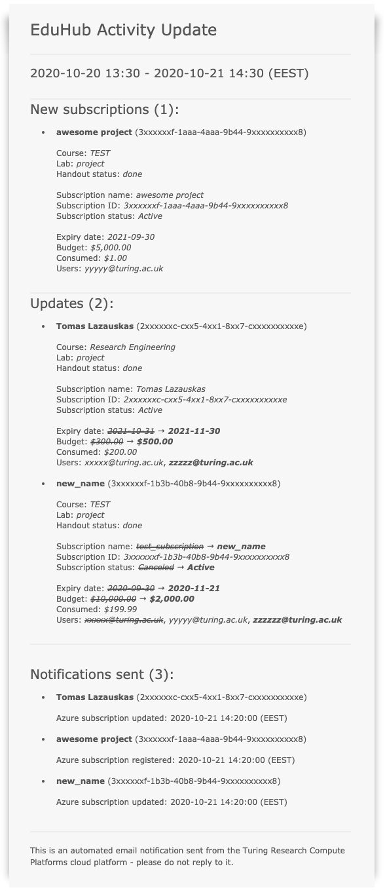

# EduHub Activity Notification Service

[](https://travis-ci.org/tomaslaz/EduNotice) [](https://opensource.org/licenses/MIT)

An Azure Function App that registers changes in the Education section of portal.azure.com and sends out emails to admins and users.

Created and designed by <a href="https://github.com/tomaslaz">Tomas Lazauskas</a>.

## Email examples

#### Summary

<p align="left">
  
</p>

## Prerequisites/Configuration/Set up

Set the required and optional environmental parameters (recommended by modifying the `~/.bash_profile` file).

#### [EduCrawler](https://github.com/tomaslaz/EduCrawler)

```{bash}
export EC_EMAIL="example@mail.com" # EduHub account email address
export EC_PASSWORD="password" # EduHub account password
export EC_MFA=false # it only works if the EduHub account has MFA switched off
```

#### SendGrid (Azure service)

- Installation (optional, an existing service might be reused)
    - On portal.azure.com navigate to `All services`
    - Find `SendGrid Accounts`
    - Create a new `SendGrid` account
      ```
      Recommended settings:
      Location: UK South
      Pricing Tier: Free
      ```
- Set up
  - go to `https://app.sendgrid.com/guide`
  - confirm the email address that was used when creating the new account
  - `Create a Single Sender`
  - Verify using the `Single Sender Verification`
  - Generate an API KEY
    - go to `API Keys`
    - `Create API Key`
      - Restricted Access
      - Allow **ONLY** `Mail Send` Full Access
  - export the API key value as `ENS_EMAIL_API` environmental parameter as shown in the `Setup` section.

- Configuration
```{bash}
export ENS_EMAIL_API="<<replace me>>" # SendGrid API Key
export ENS_FROM_EMAIL="<<replace me>>" # Sender email address
export ENS_SUMMARY_RECIPIENTS="<<replace me>>" # a list of email address to whom summary emails will be send to
```

#### Container Registry (Azure service)

- Installation (optional, an existing service might be reused)
  - On portal.azure.com navigate to `All services`
  - Find `Container registries`
  - `Add`
  ```
  Recommended settings:
  Location: UK South
  SKU: Basic
  ```
  - go to resource
  - Settings -> Access keys
    - Enable `Admin user`
    - export `Username` as `ENS_DOCKER_USER`
    - export `password` as `ENS_DOCKER_PASS`
- Configuration
```{bash}
export ENS_DOCKER_IMAGE="<<replace me>>" # ex. registryname.azurerc.io/edunoticefuncapp:latest
export ENS_DOCKER_USER="<<replace me>>"
export ENS_DOCKER_PASS="<<replace me>>"
```

#### EduHub Activity Notification Service as a FunctionApp

- Configuration

```{bash}
# Azure Subscription
export ENS_SUBSCRIPTION_ID="<<replace me>>"

# Configure PostgreSQL DB
export ENS_SQL_SERVER="<<replace me>>"
export ENS_SQL_USERNAME="<<replace me>>"
export ENS_SQL_PASS="<<replace me>>"
export ENS_SQL_DBNAME="<<replace me>>"
export ENS_SQL_PORT="<<replace me>>"

export ENS_SQL_WHITELISTED_IP="<<replace me>>"

export ENS_SQL_HOST=$ENS_SQL_SERVER".postgres.database.azure.com"
export ENS_SQL_USER=$ENS_SQL_USERNAME"@"$ENS_SQL_SERVER
```
- FunctionApp container

The following make commands build and publish the custom FunctionApp container to the container registry.

```{bash}
cd EduNotice
make build
make push
```

#### Azure services

The `infrastructure.sh` bash script has two modes: `TEST` and `PROD`. Each of them in turn will:

- check if an appropriate resource group exists
- storage account is created
- PostgreSQL DB established
- republish EduHub Activity Notification Service FunctionApp
- update FunctionApp's `local.settings.json` local configuration file

```{bash}
cd EduNotice/utils/infrastructure
./infrastructure.sh
```

## Getting help
If you found a bug or need support, please submit an issue [here](https://github.com/tomaslaz/EduNotice/issues/new).

## How to contribute
We welcome contributions! If you are willing to propose new features or have bug fixes to contribute, please submit a pull request [here](https://github.com/tomaslaz/EduNotice/pulls).
